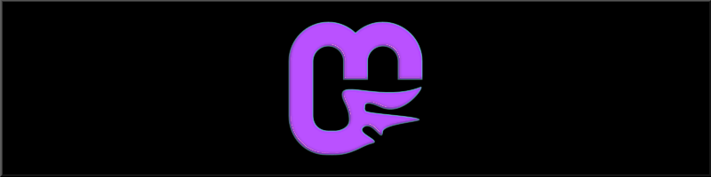

# Welcome to MonoGame.Forms!
[](https://twitter.com/sqrMin1)
[](https://github.com/sqrMin1/MonoGame.Forms/wiki)
[](https://github.com/sqrMin1/MonoGame.Forms/blob/master/LICENSE)

[](https://www.nuget.org/packages/MonoGame.Forms.DX/2.0.0)
[](https://www.nuget.org/packages/MonoGame.Forms.GL/2.0.0)
[-red.svg?style=flat-square&colorA=3260c4&colorB=77c433)](https://www.nuget.org/packages/MonoGame.Forms/)

MonoGame.Forms is the easiest way of integrating a MonoGame render window into your Windows Forms project. It should make your life much easier, when you want to create your own editor environment. 

#### Now with OpenGL support!

### Building

* The **MonoGame.Forms.DX** project uses the MonoGame.Framwork 3.7.0.1114, which is already precompiled and included in this repo.
  * It's possible to use older **MonoGame.Frameworks** like the **3.6** iteration, but you will then lose the **Mouse.GetState()** functionallity. You would then rely on the **WindowsForms Event System** for mouse input, which can be slower in some cases.
* The **MonoGame.Forms.GL** project uses a modified version of the MonoGame.Framwework based on the development build from 16th of JULY 2018.
  * It's **not** possible to exchange the MonoGame.Framework easily. If you want to use a newer build, it would be neccessary to modify it to suit the needs of MonoGame.Forms!

# How-To
#### Setup MonoGame.Forms

First you need to make your MonoGame.Forms library ready to use. This step is very easy; you just need to compile either the MonoGame.Forms.DX or the MonoGame.Forms.GL PCL from source and then just add the compiled DLL's to your project.

↳ _This is the prefered route, when you want to make you own custom changes to the library or extend it_.

Another option is to install the library with the NuGet package manager:


↳ _This is the prefered and easiest route to be automatically up to date_.

> Note: You need to set the .Net Framework version to 4.5.1 to install from NuGet!

***

### Tutorial

The following tutorial is working exactly the same on both libraries (DX and GL).

#### Creating a simple [DrawWindow](https://github.com/sqrMin1/MonoGame.Forms/wiki/3D4B182C)

Let's start using the MonoGame.Forms library by creating a simple draw window! 

_(it's assumed that you already have created a new **Windows Forms** project with the installed library)_

1. Create a new class and name it **DrawTest**
2. Inherit from **MonoGame.Forms.Controls.DrawWindow**
3. Override the **Initialize()** method from DrawWindow
4. Override the **Draw()** method from DrawWindow
5. **Save & Build** your solution
6. **Double Click** on **Form1.cs** so that the Designer opens
7. Open the **Toolbox**
8. **Drag & Drop** the newly created control onto the Form1 control
9. Open the **Properties** of the new control and set the **Dock** option to **Fill**

This is how it should look now:


10. Now run the solution and see the classical **CornflowerBlue-Screen** you are (surly) familiar with! ;-)


And yes, as you can see: it is realy **THAT EASY**!

Now I bet you wonder how to draw something to this control, right? I bet you think that this is now the difficult part, right?
Well... it's not!

More than that it's basically the same like you are used to do in the **MonoGame.Framework**. 
Just with a small difference (no it's still not difficult!)

In MonoGame you could draw someting to the screen with the [SpriteBatch](https://msdn.microsoft.com/de-de/library/microsoft.xna.framework.graphics.spritebatch(v=xnagamestudio.40).aspx).
In **MonoGame.Forms** you will do the same but you need to use the [DrawService](https://github.com/sqrMin1/MonoGame.Forms/wiki/AC3C5B70) for this.

In the **DrawWindow** class this service is called **Editor**. To draw something to the **SpriteBatch** you need to do this:

```c
Editor.spriteBatch.DrawString();
```

Do you see? Easy! :)

The **DrawService** class inherits from [GFXService](https://github.com/sqrMin1/MonoGame.Forms/wiki/3A4C800C).
It contains some MonoGame specific stuff like a [ContentManager](https://github.com/sqrMin1/MonoGame.Forms/wiki/A72EF9E7).
Examine everything calmly. I just want to explain a little how **MonoGame.Forms** works under the hood!

To sum things up, let's take a look at the final **DrawTest** class:

```c
using Microsoft.Xna.Framework;
using MonoGame.Forms.Controls;

namespace nugetTest
{
    public class DrawTest : DrawWindow
    {
        string WelcomeMessage = "Hello MonoGame.Forms!";

        protected override void Initialize()
        {
            base.Initialize();
        }

        protected override void Draw()
        {
            base.Draw();

            Editor.spriteBatch.Begin();

            Editor.spriteBatch.DrawString(Editor.Font, WelcomeMessage, new Vector2(
                (Editor.graphics.Viewport.Width / 2) - (Editor.Font.MeasureString(WelcomeMessage).X / 2),
                (Editor.graphics.Viewport.Height / 2) - (Editor.FontHeight / 2)),
                Color.White);

            Editor.spriteBatch.End();
        }
    }
}
```
Result:


It's pretty much like in the **MonoGame.Framework!**

***

#### Creating a simple [UpdateWindow](https://github.com/sqrMin1/MonoGame.Forms/wiki/F370F561)

As you might though right: Yes, this is also very easy. It's the same like for the **DrawWindow**. 
I just want to show you the only difference:

```c
protected override void Update(GameTime gameTime)
{
    base.Update(gameTime);
}
```

The update method makes realtime interactions with your game- / editor environment possible. Even complex mechanics are doable.

I just want to refer to the nice [MonoGame.Forms.Test](https://github.com/sqrMin1/MonoGame.Forms/tree/master/MonoGame.Forms.Tests)-Project,
which is part of this repo. Take a look at it and learn from its samples.

> Note: To raise the performance of an OpenGL UpdateWindow, it's recommended to change the **DrawIntervall** from 1ms to 50ms or 100ms!


Did you notice the **BackColor** and **ForeColor** property? 
Changing these values makes it possible to style your controls to something like this:


Do it to keep the overview and feel of your custom editor project!
> Note: The MonoGame logo is placed automatically inside a newly created control to make it clear, that it is a render control with MonoGame functionality!

### Sample Pics

Here are some pics of some samples included with the repo:

### DX (Windows 10 Pro 64 bit)


### GL (Ubuntu 18.04 LTS [Bionic Beaver] 64 bit)


# Projects using MonoGame.Forms!

Please watch the following YouTube videos in *1080p @ 60fps* to see what is possible with MonoGame.Forms!

###### This project is called: "**Rogue Engine Editor**" and it's possible to create Rogue Adventures with it:

[](https://youtu.be/6fyQ64O9HME)

Twitter: [#RogueEngineEditor](https://twitter.com/hashtag/RogueEngineEditor?src=hash)

***

###### This project is called: "**PenumbraPhysics.Editor**" and it was the prototype for the Rogue Engine Editor and MonoGame.Forms:

[](https://youtu.be/vQAxXN_V3X4)

GitHub: [PenumbraPhysics.Editor](https://github.com/sqrMin1/PenumbraPhysics.Editor)

***

### Now Have Fun with MonoGame.Forms!
[](https://twitter.com/sqrMin1)
[](https://github.com/sqrMin1/MonoGame.Forms/wiki)
[](https://github.com/sqrMin1/MonoGame.Forms/blob/master/LICENSE)

[](https://www.nuget.org/packages/MonoGame.Forms.DX/2.0.0)
[](https://www.nuget.org/packages/MonoGame.Forms.GL/2.0.0)
[-red.svg?style=flat-square&colorA=3260c4&colorB=77c433)](https://www.nuget.org/packages/MonoGame.Forms/)


### Special Thanks
- [nkast](https://github.com/nkast) and [SpiceyWolf](https://github.com/SpiceyWolf) from the MonoGame community
- everyone else from the official [MonoGame.Forms_Thread](http://community.monogame.net/t/monogame-forms-create-your-editor-environment/9954)
- the awesome MonoGame community itself :)
