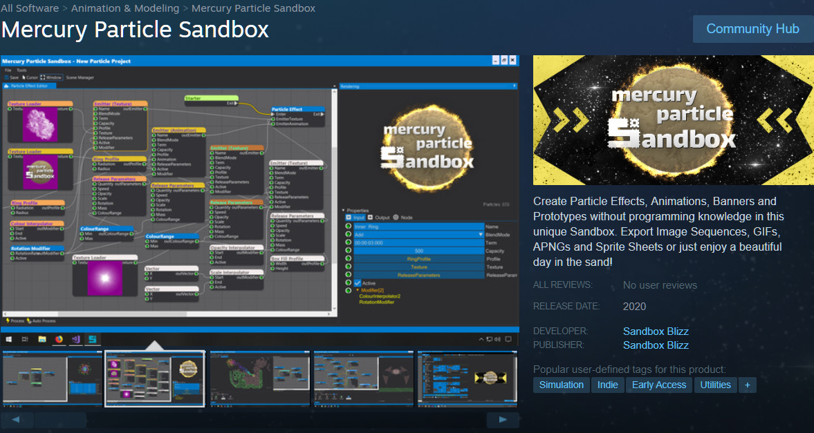
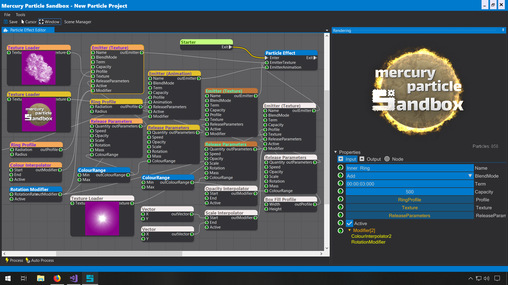
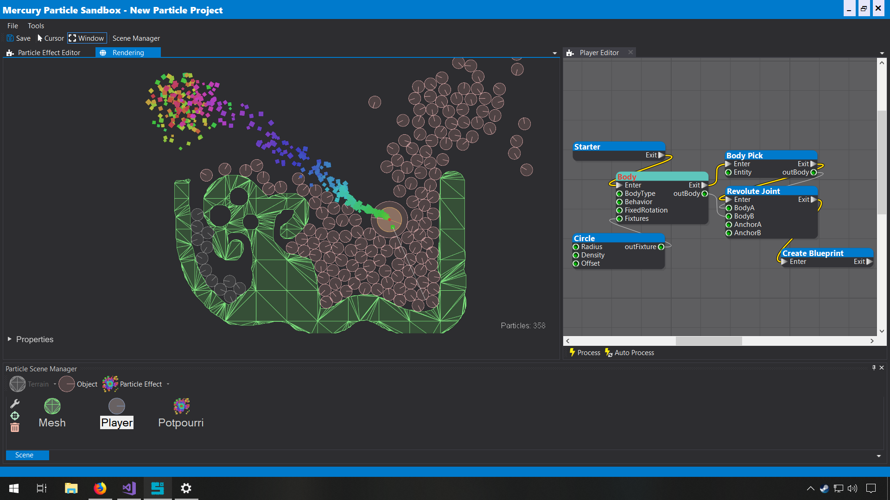
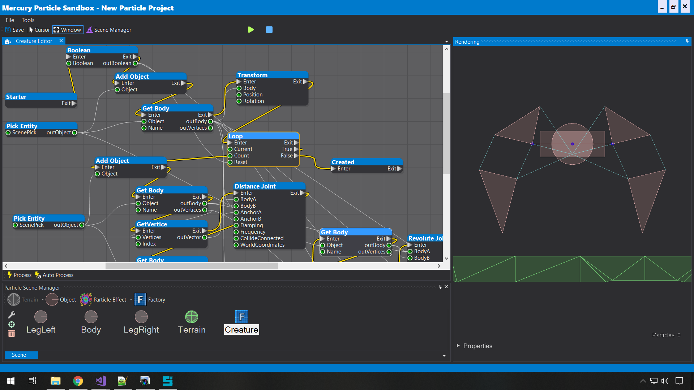
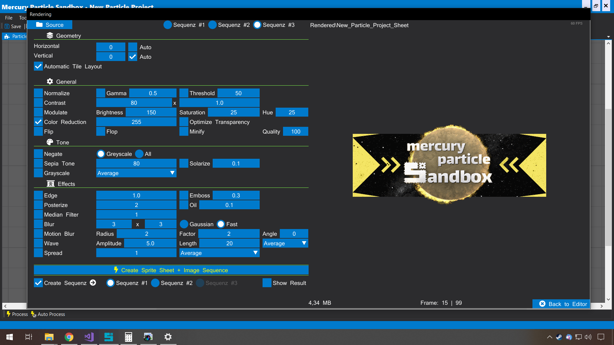
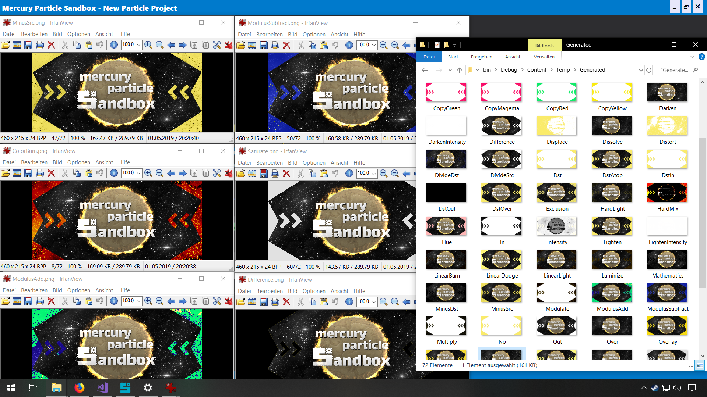

A message from the developer:

# Mercury Particle Sandbox

The first application on **Steam** which uses the MonoGame.Forms library!

Click on the image to visit the [Steam Store Page](https://store.steampowered.com/app/838870/Mercury_Particle_Sandbox/) and read the full app description.

**Following** and adding it to your **Wishlist** is the **best way** to support the MonoGame.Forms library, the Mercury Particle Sandbox and me!

**Thank you** very much for your ongoing support!

:: Sandbox Blizz 💖

---

> ### [Click here to go back to the original **Readme.md** file of **MonoGame.Forms**](https://github.com/sqrMin1/MonoGame.Forms/blob/master/MonoGame.Forms.Readme.md)

---

# Mercury Particle Sandbox - Screenshots

---

> ### [Click here to go back to the original **Readme.md** file of **MonoGame.Forms**](https://github.com/sqrMin1/MonoGame.Forms/blob/master/MonoGame.Forms.Readme.md)

---
